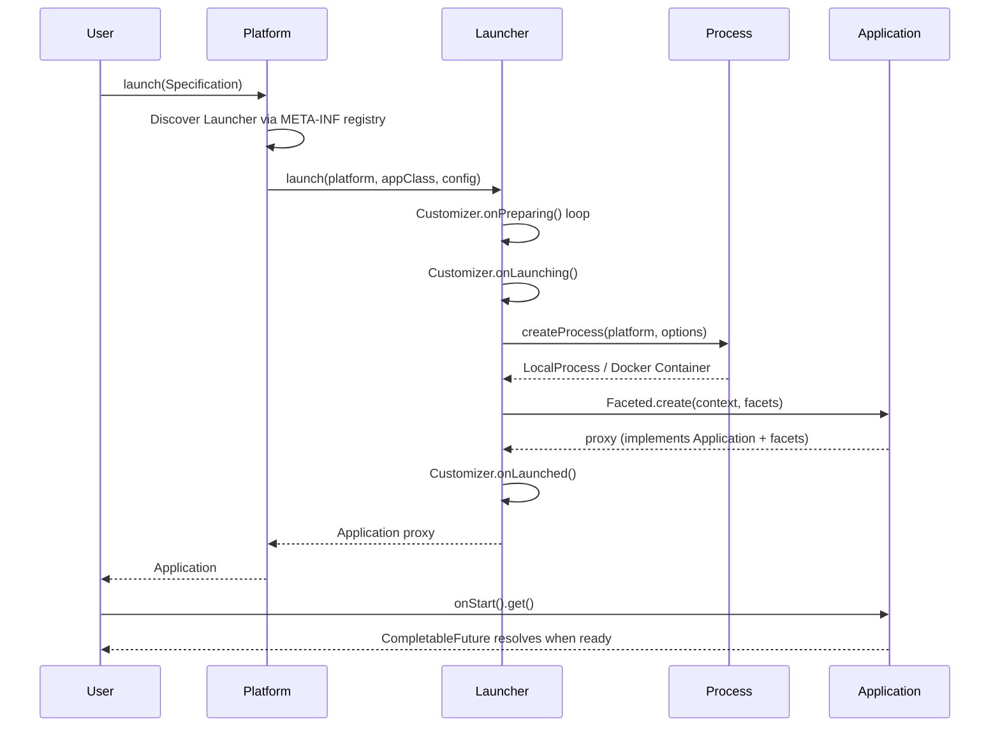

# Codebase Map

> Auto-generated by Cartographer. Last mapped: 2026-04-01

## System Overview

Spawn is a Java 25 framework for programmatically launching and controlling processes (OS processes, JVMs, Docker containers). The core abstraction: define a `Specification`, call `platform.launch(spec)`, get back an `Application` with `CompletableFuture`-based lifecycle hooks.

```mermaid
graph TB
    subgraph Core["spawn-application (core abstractions)"]
        Platform
        Application
        Process
        Specification
        Customizer
        Launcher
        Faceted
    end

    subgraph Option["spawn-option"]
        EnvironmentVariable
    end

    subgraph Composition["spawn-application-composition"]
        Composable
        Composition
        ApplicationStream
    end

    subgraph JDK["spawn-jdk (JDK abstractions)"]
        JDKApplication
        SpawnAgent
        EmbeddedServer
        JDKOptions["JVM option types"]
    end

    subgraph LocalPlatform["spawn-local-platform"]
        LocalMachine
        LocalProcess
        LocalLauncher
    end

    subgraph LocalJDK["spawn-local-jdk"]
        JDKDetector
        JDKHomeBasedPatternDetector
        LocalJDKLauncher
    end

    subgraph DockerAPI["spawn-docker (Docker interface)"]
        Session
        Container
        Image
        Network
        DockerOptions["Docker option types"]
    end

    subgraph DockerImpl["spawn-docker-jdk (JDK impl)"]
        AbstractSession
        SessionFactories["Session.Factory impls"]
        Commands["Command classes"]
        Models["Model classes"]
    end

    Option --> Core
    Core --> Composition
    Core --> JDK
    Core --> LocalPlatform
    JDK --> LocalJDK
    LocalPlatform --> LocalJDK
    Core --> DockerAPI
    DockerAPI --> DockerImpl
```



## Directory Structure

```
spawn.build/
├── config/checkstyle/       # Checkstyle rules (tabs, star imports, finals, braces)
├── docs/                    # Architecture documentation (this file)
├── spawn-option/            # JPMS: build.spawn.option — shared option types
├── spawn-application/       # JPMS: build.spawn.application — core abstractions
├── spawn-application-composition/ # JPMS: build.spawn.application.composition
├── spawn-jdk/               # JPMS: build.spawn.jdk — JDK abstractions + SpawnAgent
├── spawn-local-platform/    # JPMS: build.spawn.platform.local — OS process launcher
├── spawn-local-jdk/         # JPMS: build.spawn.platform.local.jdk — JDK detection
├── spawn-docker/            # JPMS: build.spawn.docker — Docker Engine API interfaces
├── spawn-docker-jdk/        # JPMS: build.spawn.docker.jdk — JDK HTTP Client implementation
└── pom.xml                  # Parent POM; manages versions, Checkstyle, Surefire
```

## Module Guide

### `spawn-option`

**Purpose:** Standalone option types shared across modules without depending on `spawn-application`.
**Entry point:** `build.spawn.option.EnvironmentVariable`
**Key files:**
| File | Purpose |
|------|---------|
| `EnvironmentVariable.java` | Immutable `key=value` pair; `MappedOption` keyed by env var name; `ResolvableOption` for expression substitution |

**Exports:** `build.spawn.option`
**Dependencies:** `build.base.*` only — no spawn-internal dependencies.
**Why separate:** Other modules (`spawn-jdk`, `spawn-docker`) can add env var support without importing the full `spawn-application` module.

---

### `spawn-application`

**Purpose:** Core framework abstractions. Defines every interface in the Spawn launch lifecycle.
**Entry point:** `Platform.launch(Specification)` → returns `Application`
**Key files:**
| File | Purpose |
|------|---------|
| `Platform.java` | Top-level launcher; `launch(Specification)` is the canonical entry point |
| `Application.java` | Running app handle; `onStart()`/`onExit()` CompletableFutures; nested `Implementation` |
| `Process.java` | Raw OS/container handle; `pid()`, `terminal()`, `onExit()` |
| `Specification.java` | Mutable launch descriptor; factory `of(Class, Option...)` |
| `Customizer.java` | Lifecycle observer stored as an `Option`; `onPreparing/onLaunching/onLaunched/onStart/onTerminated` |
| `Launcher.java` | Functional interface; performs platform-specific launch work |
| `Machine.java` | `Platform` that is also `Addressable`; `workingDirectory()`, `temporaryDirectory()` |
| `AbstractTemplatedPlatform.java` | META-INF registry discovery, expression resolution, customizer auto-discovery, cascading preparation loop |
| `AbstractTemplatedLauncher.java` | Full launch orchestration: facet assembly, argument conversion, diagnostics tabulation |
| `AbstractApplication.java` | Wires process I/O to console via Pipes; registers customizer callbacks; `@Inject Iterable<Lifecycle<?>>` |
| `Console.java` | stdin/stdout/stderr abstraction; `Console.Supplier` option selects implementation |
| `facet/Faceted.java` | JDK proxy implementing multiple unrelated interfaces simultaneously |
| `facet/FacetedInvocationHandler.java` | Dispatch: primary map + lazy superinterface map + `Faceted.as()` escape hatch |
| `option/WaitFor.java` | `Customizer` that holds `onStart()` until a regex matches stdout/stderr |
| `option/EnvironmentVariables.java` | Strategy: `none()` (default) vs `inherited()` (copies `System.getenv()`) |

**Exports:** `build.spawn.application`, `.console`, `.facet`, `.option`
**Dependencies:** `spawn-option`, `build.base.*`, `build.codemodel.injection`, `jakarta.inject`

**Option type pattern** (applies everywhere):
- Private constructor + `static of(...)` factory
- Extends `AbstractValueOption<T>` (value equality, `get()`)
- `@Default` static method → framework default when none configured
- `CollectedOption<List>` for multi-valued options (accumulate, not replace)
- `ResolvableOption<Self>` for expression substitution
- `Tabular` to appear in launch diagnostics table

---

### `spawn-application-composition`

**Purpose:** Multi-application topology management. Dependency-ordered launch, bulk lifecycle ops.
**Entry point:** `Composition.Builder.create().using(platform).add(...).build()`
**Key files:**
| File | Purpose |
|------|---------|
| `Composition.java` | Thread-safe collection of running apps; `Builder` with topological sort for launch order |
| `Composable.java` | Fluent handle for one role in a composition; `require(Composable)` for dependency ordering |
| `ApplicationStream.java` | `Stream<A>` extension adding `onStart/onExit/suspend/resume/shutdown/destroy/relaunch/clone` |
| `option/ApplicationIdentifier.java` | Integer slot ID; `${application.id}` expression variable |

**Dependencies:** `spawn-application`, `spawn-jdk` (for `SystemProperty` injection of app ID)
**Gotchas:**
- `Builder.platform` initializes to `null`; must call `using(Platform)` before `build()`
- `clone()` is partially implemented (commented out) — cloning/relaunching is broken

---

### `spawn-jdk`

**Purpose:** JDK-specific abstractions and the SpawnAgent two-way communication mechanism.
**Entry point:** `JDKSpecification` → `platform.launch(spec)` → `JDKApplication`
**Key files:**
| File | Purpose |
|------|---------|
| `JDKApplication.java` | Extends `Application`; adds `submit(SerializableCallable)` for remote lambda execution; `Customizer` sets JVM defaults |
| `JDK.java` | Immutable `JDKVersion + JDKHome` pair; `JDK.current()` |
| `JDKSpecification.java` | Concrete leaf specification (fixes generic params) |
| `AbstractJDKSpecification.java` | Fluent builder with `withMainClass/withClassPath/withSystemProperty` |
| `AbstractTemplatedJDKLauncher.java` | Resolves `getName()` from `MainClass` or `Jar`; injects `Server` for subclasses |
| `agent/SpawnAgent.java` | Java agent `premain`; bootstraps `EmbeddedServer` in an isolated `CustomClassLoader` |
| `agent/EmbeddedServer.java` | Client inside the child JVM; connects back to parent `Server`; `createProducer()` |
| `agent/SpawnAgentArchiveBuilder.java` | Builds `spawn-agent.jar` at runtime; separates root vs `internal/` class zones for isolation |
| `Publishing.java` | Static entry point for child JVM code to call `createProducer()` |
| `option/ClassPath.java` | `-classpath`; `LinkedHashSet` preserving order; `inherited()` reads `java.class.path` |
| `option/ModulePath.java` | `-p`; modular JDKs only; `inherited()` reads `jdk.module.path` |
| `option/SystemProperty.java` | `-Dkey[=value]`; `MappedOption<String>`; expression-resolvable |
| `option/JDKAgent.java` | `-javaagent:path[=args]`; `CollectedOption<List>` |
| `option/Headless.java` | Enum; `ENABLED` is `@Default`; `DISABLED` emits no tokens |

**SpawnAgent two-way communication flow:**
```
Parent JVM                              Child JVM
Server (listens on spawn:// URI)
  │
  │  SpawnAgentArchiveBuilder.createArchive()
  │  Launch child: -javaagent:spawn-agent.jar=machine=<uri>,launchId=<id>
  │                                        JVM calls SpawnAgent.premain()
  │                                          Reads internal/*.class from jar
  │                                          Loads via CustomClassLoader
  │                                          EmbeddedServer.start() connects Client
  │
  Server.onConnection(launchId) ◄──── Client connects with launchId
  JDKApplication.connection future completes
  │
  submit(callable) ─────────────────► Connection.submit(callable) executes it
  ◄──────────────────────────────── returns result
  │
  ApplicationSubscriber receives ◄─── EmbeddedServer.createProducer().publish(item)
```

**Known bugs in `spawn-jdk`:**
- `SpawnAgent.parseArguments` splits on `"="` without limit — token values containing `=` (e.g. Base64) are silently dropped. Fix: `s.split("=", 2)`. Documented in `SpawnAgentArgumentParsingTests`.
- `PatchModule.detect()` has the same split bug for `--patch-module=module=path` args.
- `AbstractHeapSize`: memory unit suffix derived from first letter of enum name — adding a misnamed `MemorySize` enum would produce wrong JVM flag silently.

---

### `spawn-local-platform`

**Purpose:** Concrete local-machine `Platform` implementation using `ProcessBuilder`.
**Entry point:** `LocalMachine.get()` (singleton) or `new LocalMachine(Option...)`
**Key files:**
| File | Purpose |
|------|---------|
| `LocalMachine.java` | Singleton `Machine`; extends `AbstractTemplatedPlatform`; PID from `RuntimeMXBean.getName()` |
| `LocalProcess.java` | Wraps `java.lang.Process`; virtual thread watcher; `suspend/resume` via `kill -STOP/-CONT` |
| `LocalLauncher.java` | `ProcessBuilder` invocation; sets env vars, working dir, arguments; double-quotes paths containing spaces |
| `META-INF/build.spawn.platform.local.LocalMachine` | Registry: `Application=LocalLauncher` |

**`suspend()`/`resume()`:** Use POSIX signals — only work on Unix/Linux/macOS.
**`shutdown()`:** SIGTERM (`process.destroy()`). **`destroy()`:** SIGKILL (`process.destroyForcibly()`).
**Gotchas:**
- Double-quote path logic in `LocalLauncher` applies only when executable is exactly `"java"` — other executables with space-containing arguments are not quoted
- Framework logging in `LocalLauncher` is at DEBUG to prevent JUL `ConsoleHandler` leaking to `System.err` (see `StderrSuppressionTests`)
- PID detection breaks if the JVM vendor uses a non-`pid@hostname` format for `RuntimeMXBean.getName()`

---

### `spawn-local-jdk`

**Purpose:** JDK detection on local filesystem + launcher for `JDKApplication` on `LocalMachine`.
**Entry point:** `JDKDetector.stream()` for detection; `LocalJDKLauncher` is auto-discovered via META-INF registry.
**Key files:**
| File | Purpose |
|------|---------|
| `JDKDetector.java` | Interface + static factories; `of(Path)` reads `release` file (no subprocess); `stream()` via `ServiceLoader` |
| `JDKHomeBasedPatternDetector.java` | `@AutoService` impl; reads `java.home.properties` OS-specific globs; caches result in `AtomicReference` |
| `LocalJDKLauncher.java` | Builds `java` command line including SpawnAgent injection; discovers or creates `spawn-agent.jar` |
| `java.home.properties` | OS-keyed glob patterns: `mac@*`, `unix@*` entries for JDK installation directories |
| `META-INF/build.spawn.platform.local.LocalMachine` | Registry: `JDKApplication=LocalJDKLauncher` |

**JDK detection two-phase approach (post commit `b7f1f96`):**
1. `paths()` — cheap: expand OS-specific globs, walk filesystem, return matching directory paths (no subprocess)
2. `detect()` — reads `release` file in each candidate, parses `JAVA_VERSION=...`, returns `SortedSet<JDK>`; cached in `AtomicReference`

**OS support for detection:**
- **macOS:** Multiple patterns for Zulu, JDK, Azul, SDKMAN, Homebrew (system + user-local)
- **Linux (unix):** `/usr/lib/jvm/java-*`, `jdk-*`, `zulu*`; `/usr/local/*jdk*`; SDKMAN; Linuxbrew (`jdk-*` and `zulu*` added in commit `ebee957`)
- **Windows:** No patterns — detection only works via `JDKDetector.current()` / `detectDefault()`

**Known log bug in `JDKHomeBasedPatternDetector`:** `{0}` used twice in "Skipping path" message instead of `{0}` and `{1}` — pattern value never appears. Documented in `JDKHomeBasedPatternDetectorLogTests`.

**`LocalJDKLauncher` command structure:**
```
"<jdk-home>/bin/java"
  -javaagent:<spawn-agent.jar>=machine=spawn://<ip>:<port>,orphanable=<bool>,launchId=<id>
  [other -javaagent:...]
  [JVM flags: -Xmx, -Xms, -Dkey=value, --add-modules, -cp, --module-path, ...]
  <MainClass> | -jar <jarfile>
  [application arguments]
```

---

### `spawn-docker`

**Purpose:** Pure-interface API module for Docker Engine interaction. No implementation code.
**Entry point:** `Sessions.createSession(injectionFramework, options)` → `Session`
**Key files:**
| File | Purpose |
|------|---------|
| `Session.java` | Top-level Docker connection; `images()`, `events()`, `networks()`, `authenticate()` |
| `Session.Factory` | `@FunctionalInterface` SPI; discovered via `ServiceLoader` |
| `Sessions.java` | ServiceLoader discovery + DI injection of factories; picks first `isOperational()` factory |
| `Container.java` | Lifecycle ops: `start/stop/kill/pause/unpause/remove/attach/exec`; `onStart/onExit` futures |
| `Image.java` | `start(Option...)` → `Container`; `names()`, `inspect()` |
| `Network.java` | `inspect()`, `delete()` |
| `Networks.java` | `inspect/create/delete` network CRUD |
| `Event.java` | Marker; `get(Class)` for type extraction |
| `DockerFileBuilder.java` | Fluent Dockerfile content builder |
| `DockerContextBuilder.java` | Builds Docker build context tarball (extends `AbstractTarBuilder`) |

**Docker option types** — all implement `DockerOption.configure(ObjectNode, ObjectMapper)`:
| Option | Docker JSON field | Notes |
|--------|------------------|-------|
| `ImageName` | (image reference) | Handles tags, SHA256 refs, registry prefixing |
| `ExposedPort` | `ExposedPorts` | Metadata only; use `PublishPort` for host mapping |
| `PublishPort` | `HostConfig.PortBindings` | **Bug:** multiple bindings for same key discarded |
| `Bind` | `HostConfig.Binds` | **Bug:** `requireNonNull` checks wrong param name |
| `Command` | `Cmd` | Sets container CMD array |
| `ContainerName` | `?name=` query param | 409 if duplicate |
| `NetworkName` | `HostConfig.NetworkMode` | |
| `PublishAllPorts` | `HostConfig.PublishAllPorts` | `@Default ENABLED` |

**Known bugs in `spawn-docker`:**
- `PublishPort.configure`: checks `objectNode.get(key)` instead of `portBindings.get(key)` → all but last binding for a given port key silently discarded (`PublishPortTests` documents)
- `Images.build(DockerContextBuilder)` swallows `IOException` from context builder (`ImagesBuildTests` documents)
- `Bind`: `requireNonNull` for `internalPath` references `externalPath` param name (copy-paste; runtime behavior correct)

---

### `spawn-docker-jdk`

**Purpose:** JDK-native concrete implementation of `spawn-docker` interfaces. Uses `java.net.http.HttpClient` for TCP and `java.nio.channels.SocketChannel` with `UnixDomainSocketAddress` for Unix domain sockets. No third-party HTTP dependencies.
**Entry point:** Four `Session.Factory` implementations discovered via `ServiceLoader`, in priority order:
1. `UnixDomainSocketBasedSession.Factory` — Unix socket (`/var/run/docker.sock` or Docker Desktop socket)
2. `LocalHostBasedSessionFactory` — TCP `localhost:2375`
3. `DockerHostVariableBasedSessionFactory` — TCP from `DOCKER_HOST` env/system property
4. `InternalDockerHostBasedSessionFactory` — TCP `host.docker.internal:2375` (inside containers)

**Key files:**
| File | Purpose |
|------|---------|
| `HttpTransport.java` | Thin transport interface; `Request` record + `Response` interface |
| `Http11Parser.java` | HTTP/1.1 response parser for raw socket streams (Content-Length + chunked) |
| `JavaHttpClientTransport.java` | `HttpTransport` impl using `java.net.http.HttpClient` for TCP |
| `UnixSocketHttpTransport.java` | `HttpTransport` impl using `UnixDomainSocketAddress` + `Http11Parser` |
| `AbstractSession.java` | `HttpTransport` + DI context + event streaming; self-implements `Images`; `Authenticate` on construction |
| `TCPSocketBasedSession.java` | TCP variant using `JavaHttpClientTransport` |
| `UnixDomainSocketBasedSession.java` | Unix domain socket variant using `UnixSocketHttpTransport` |
| `command/AbstractCommand.java` | Template method for `HttpTransport` request/response lifecycle |
| `command/AbstractBlockingCommand.java` | Short-lived synchronous commands |
| `command/AbstractNonBlockingCommand.java` | Streaming commands (events, attach); keeps response open |
| `command/AbstractEventBasedBlockingCommand.java` | Subscribes to events before sending request; used by `PullImage` |
| `command/FrameProcessor.java` | Demultiplexes Docker's 8-byte-header binary stream protocol |
| `event/GetSystemEvents.java` | Streaming JSON parser; publishes `ActionEvent`; virtual thread |
| `model/DockerContainer.java` | Full `Container` impl; `@PostInject` wires event subscription for `onStart/onExit` |
| `model/DockerImage.java` | `Image` impl; `start()` creates then starts container; auto-removes on start failure |
| `model/AbstractJsonBasedResult.java` | DI-injected `Session`, `JsonNode`, `ObjectMapper` for all model classes |

**Known bugs:**
- `GetSystemEvents` and `DockerContainer` have debug `System.out.println` calls in production code
- `CopyFiles` constructor validation inverts the check (throws when file has content instead of when it's empty)
- `NetworkInformation.driver()` reads lowercase `"driver"` but Docker API returns `"Driver"` → always returns empty string
- `ContainerInformation.links()`: splits on `:` — `ArrayIndexOutOfBoundsException` if link string has no colon

## Conventions

### Brian Oliver Java Style
- No tabs (spaces only), enforced by Checkstyle
- No star imports
- Final locals where possible
- No `assert` statements
- Braces required on all blocks

### Launcher Registry Pattern
Platform classes have a `META-INF/<ConcreteClassName>` properties file on the classpath. Each line: `ApplicationClass=LauncherClass`. Multiple modules can contribute to the same registry file. `AbstractTemplatedPlatform` discovers launchers by reading all matching resources and selecting the most-specific `Application` supertype match (NOT `findFirst()` — avoids classpath-order bugs).

### Nested Class Conventions
- `Application.Implementation` (or `JDKApplication.Implementation`) — public static concrete class found by `Application.getImplementationClass()` via reflection
- `Application.Customizer` — auto-discovered if public static non-abstract; instantiated via DI and added to launch options automatically
- These conventions enable zero-configuration application discovery

### Docker Tests
Tests requiring Docker are gated by `@EnabledIf("isDockerAvailable")` — they will skip gracefully in CI environments without Docker.

## Gotchas

### Faceted Proxy
The returned `Application` from `launch()` is a JDK `Proxy` (`Faceted` implementation), NOT a direct instance of `Application.Implementation`. `instanceof Application.Implementation` will always return `false`. Use interface types or `Faceted.as(Class)`.

### `Iterable<Lifecycle<?>> lifecycles` in `AbstractApplication`
This is `@Inject`-annotated. If an `AbstractApplication` subclass is created outside the DI framework, `lifecycles` will be `null` and `onStart()` will throw `NullPointerException`.

### Default Environment Variables
`@Default` on `EnvironmentVariables.none()` means child processes inherit NO environment variables by default. Add `EnvironmentVariables.inherited()` explicitly to pass through the parent JVM's environment.

### `WaitFor` Pattern Matching
`String.matches()` is a full-string regex match (anchored). `WaitFor.stdout("started")` will NOT match — use `".*started.*"`.

### `JDK.compareTo` vs `JDK.equals` Asymmetry
`compareTo` is by version only; `equals` requires both version and home to match. Two `JDK` instances with the same version but different homes are `compareTo == 0` but `equals == false`. Can cause surprising behavior in sorted sets.

### SpawnAgent Isolation
`EmbeddedServer` is intentionally loaded in a `CustomClassLoader` isolated from the application. `SpawnAgentDiagnosticApplication` verifies this — if `EmbeddedServer` is visible to the app classloader, the agent jar packaging is broken.

### `Orphanable.DISABLED` (default)
Child JDK processes are killed when the parent JVM exits by default. Use `Orphanable.ENABLED` if the child should survive the parent. The enforcement is via `EmbeddedServer.onStopped()` which calls `Runtime.getRuntime().halt(0)`.

### Composition Null Platform
`Composition.Builder.platform` initializes to `null`. Calling `build()` without `using(Platform)` will throw `NullPointerException` at the first composable launch.

## Navigation Guide

**To launch a local OS process:**
- `LocalMachine.get().launch("echo", Argument.of("hello"))`
- Files: `LocalMachine.java`, `LocalLauncher.java`, `MachineComplianceTests.java`

**To launch a JVM subprocess:**
- `LocalMachine.get().launch(new JDKSpecification().withMainClass(MyApp.class))`
- Files: `JDKSpecification.java`, `LocalJDKLauncher.java`, `MachineAgnosticJDKApplicationComplianceTests.java`

**To wait for application readiness:**
- Add `WaitFor.stdout(".*Server started.*")` to the specification options
- Files: `option/WaitFor.java`, `MachineComplianceTests.java#shouldObserveApplicationCustomizerCallbacks`

**To create a custom Application type:**
1. Create interface extending `Application` (or `JDKApplication`)
2. Add nested `public static class Implementation extends AbstractApplication`
3. Optionally add `public static class Customizer implements Customizer<MyApp>` for defaults
4. Register a `Launcher` in `META-INF/<PlatformClassName>`: `MyApp=MyLauncher`
- Files: `Application.java`, `AbstractApplication.java`, `Launcher.java`, `AbstractTemplatedLauncher.java`

**To add a Docker option:**
- Implement `DockerOption.configure(ObjectNode, ObjectMapper)` in a new class
- Implement `CollectedOption<LinkedHashSet>` if multiple instances should accumulate
- Files: `DockerOption.java`, existing option classes in `spawn-docker/src/main/java/build/spawn/docker/option/`

**To connect to Docker:**
- `Sessions.createSession(injectionFramework, option...)` — auto-discovers the first operational factory
- Files: `Sessions.java`, `UnixDomainSocketBasedSession.java`, `SessionTests.java`

**To detect local JDKs:**
- `JDKDetector.stream().flatMap(JDKDetector::detect)` — discovers all installed JDKs via glob patterns
- `JDKDetector.current()` — the JDK running the current JVM
- Files: `JDKDetector.java`, `JDKHomeBasedPatternDetector.java`, `java.home.properties`

**To publish data from a child JVM to the parent:**
- In child: `Publishing.createProducer("topic", ItemType.class).ifPresent(p -> p.publish(item))`
- In parent spec: `ApplicationSubscriber.of("topic", ItemType.class, item -> ...)`
- Files: `Publishing.java`, `EmbeddedServer.java`, `option/ApplicationSubscriber.java`, `PublishingApplication.java`

**To run a multi-application topology:**
- `Composition.Builder.create().using(platform).add(AppA.class).add(AppB.class).require(composableA).build()`
- Files: `Composition.java`, `Composable.java`, `ApplicationStream.java`

**To add a new OS pattern for JDK detection:**
- Edit `spawn-local-jdk/src/main/resources/java.home.properties`
- Format: `<os-pattern>@<unique-name> = <glob-or-literal-path>`
- OS patterns: `mac`, `windows`, `unix`, `posix`, or any regex matched against `os.name.toLowerCase()`

If cartographer helped you, consider starring: https://github.com/kingbootoshi/cartographer - please!
