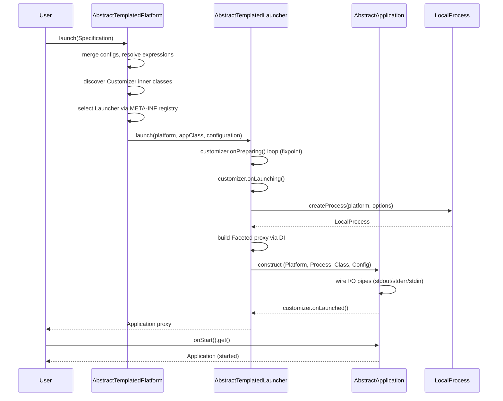
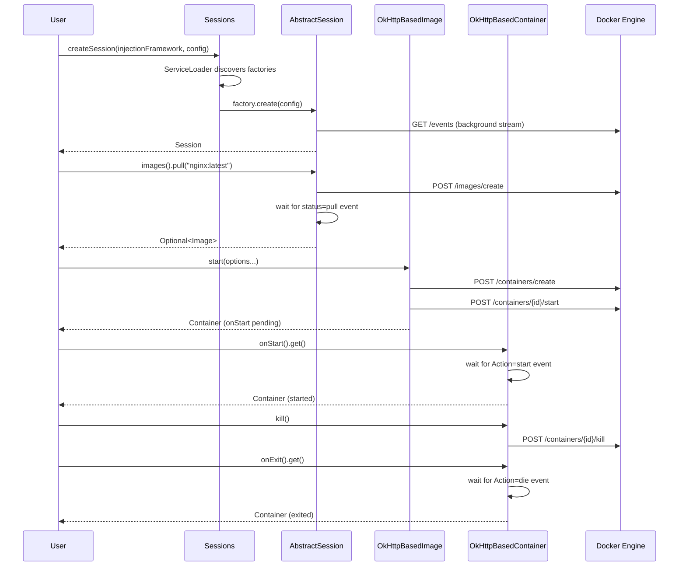
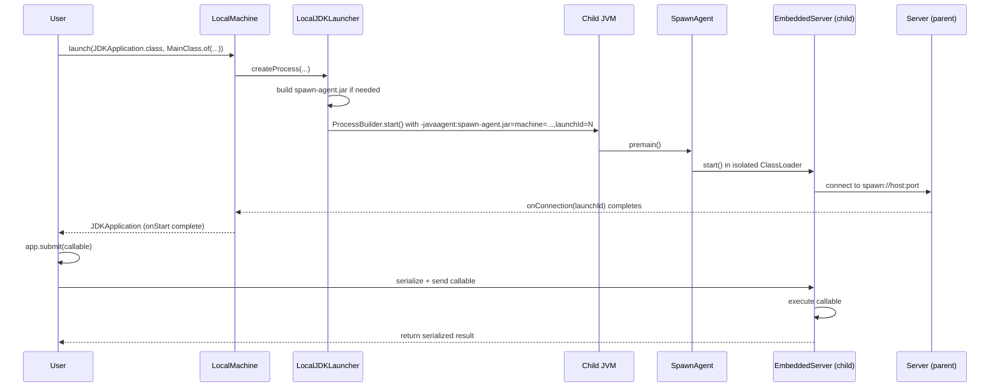

# Codebase Map — spawn

> Auto-generated by Cartographer. Last mapped: 2026-03-04T14:39:22Z

## System Overview

Spawn is a Java framework for programmatically launching and controlling processes, JVMs, and Docker containers. It provides a unified abstraction (`Platform` / `Application` / `Process`) over different execution environments.

```mermaid
graph TB
    subgraph API["Core Abstractions (spawn-application)"]
        Platform
        Launcher
        Application
        Process
        Specification
        Customizer
    end

    subgraph Composition["spawn-application-composition"]
        Composition
        ApplicationStream
        Composable
    end

    subgraph JDK["JDK Support (spawn-jdk)"]
        JDKApplication
        SpawnAgent
        JDKOptions["JDK Options"]
    end

    subgraph LocalPlatform["Local Platform (spawn-local-platform)"]
        LocalMachine
        LocalLauncher
        LocalProcess
    end

    subgraph LocalJDK["Local JDK (spawn-local-jdk)"]
        LocalJDKLauncher
        JDKDetector
    end

    subgraph Docker["Docker API (spawn-docker)"]
        Session
        Container
        Image
        Network
    end

    subgraph DockerImpl["Docker OkHttp (spawn-docker-okhttp)"]
        AbstractSession
        Commands["35+ Command classes"]
        Models["Model classes"]
        Factories["4 Session.Factory impls"]
    end

    subgraph Option["spawn-option"]
        EnvironmentVariable
    end

    Option --> API
    API --> JDK
    API --> LocalPlatform
    JDK --> LocalJDK
    LocalPlatform --> LocalJDK
    API --> Composition
    JDK --> Composition
    Docker --> DockerImpl
    Option --> DockerImpl

    LocalMachine -->|"via META-INF registry"| LocalJDKLauncher
    Factories -->|"ServiceLoader SPI"| Session
```

---

## Directory Structure

```
spawn/
├── .mvn/wrapper/                  Maven wrapper config
├── .security_config/              Workday Chimera AppSec scanning config
├── config/
│   ├── checkstyle/               Checkstyle rules (Java 25, no tabs, no star imports)
│   └── intellij/                 IntelliJ code style (SisypheanCodeStyle)
├── config/maven/                 Internal Artifactory settings.xml
├── jenkins/
│   ├── release/Jenkinsfile       9-stage release pipeline
│   └── snapshot/Jenkinsfile      CI snapshot build pipeline
├── spawn-option/                 Shared option types (EnvironmentVariable)
├── spawn-application/            Core abstractions: Platform, Application, Process, etc.
├── spawn-application-composition/ Multi-application topology management
├── spawn-jdk/                    JDK-specific launch abstractions + SpawnAgent
├── spawn-local-platform/         Local OS process launcher (LocalMachine)
├── spawn-local-jdk/              Local JDK detection + LocalJDKLauncher
├── spawn-docker/                 Docker Engine API interface definitions
├── spawn-docker-okhttp/          OkHttp-based Docker Engine API implementation
├── pom.xml                       Root POM: version=0.0.5-SNAPSHOT, Java 25
└── README.md
```

---

## Module Guide

### `spawn-option`

**Purpose**: Shared option value types used across other modules.

**Entry point**: `build.spawn.option`

**Key files**:
| File | Purpose |
|------|---------|
| `EnvironmentVariable.java` | Immutable key/optional-value OS env var option with expression resolution |

**Key API**: `EnvironmentVariable.of(key)`, `EnvironmentVariable.of(key, value)`

**Patterns**: Immutable value-object, `ResolvableOption` for `${expr}` substitution, `Tabular` for diagnostic display

**Gotchas**: Two `EnvironmentVariable` instances with the same key but different values are NOT equal — they accumulate in a `CollectedOption` list

---

### `spawn-application`

**Purpose**: Core interfaces and abstract base classes defining the platform/application/process abstraction. All other modules build on this.

**Entry point**: `build.spawn.application`

**Key files**:
| File | Purpose | Tokens |
|------|---------|--------|
| `Platform.java` | Launches applications; all `launch(...)` overloads funnel to `launch(Specification<A>)` | ~200 |
| `Application.java` | Primary interface for all launched apps; lifecycle hooks, console, process access | ~300 |
| `Launcher.java` | `@FunctionalInterface` strategy for creating an Application on a Platform | ~80 |
| `Process.java` | Wraps a running OS process (pid, suspend, resume, shutdown, destroy) | ~200 |
| `Specification.java` | Mutable DSL describing how to launch a specific Application class | ~200 |
| `Lifecycle.java` | `onStart()` / `onExit()` `CompletableFuture` hooks | ~60 |
| `Console.java` | stdin/stdout/stderr abstraction + static factories (`ofSystem()`, `none()`) | ~150 |
| `Customizer.java` | `CollectedOption` lifecycle interceptor with ~8 hooks | ~250 |
| `Machine.java` | `Platform` + `Addressable`; represents a local OS with temp/working dirs | ~80 |
| `Addressable.java` | Entities with `InetAddress`es | ~40 |
| `AbstractTemplatedPlatform.java` | Base `Platform` impl: discovers Launchers from `META-INF/<ClassName>` files, DI setup, expression resolution | ~600 |
| `AbstractTemplatedLauncher.java` | Full launch pipeline: customizer prep loop, process creation, `Faceted` proxy creation | ~500 |
| `AbstractApplication.java` | Wires Process + Console + Customizers + I/O pipes via `@Inject` | ~400 |
| `AbstractProcess.java` | Base `Process` with blocking shutdown | ~100 |
| `facet/Facet.java` | Interface+impl factory pair stored as `CollectedOption` | ~80 |
| `facet/Faceted.java` | Marker interface for JDK `Proxy` implementing multiple facets | ~80 |
| `facet/FacetedInvocationHandler.java` | Routes proxy method calls to correct facet impl; lazy superclass resolution | ~250 |

**Option sub-package**:
| File | Purpose |
|------|---------|
| `option/Name.java` | Application display name (`@Default` = UUID-based unique name) |
| `option/Executable.java` | Path to the executable |
| `option/Argument.java` | `CollectedOption` command-line argument (expression-resolved) |
| `option/EnvironmentVariables.java` | Strategy: `none()` (default) or `inherited()` (copies current JVM env) |
| `option/WaitFor.java` | Customizer: gates `onStart()` until regex observed on stdout/stderr |
| `option/DiagnosticName.java` / `DiagnosticNameProvider.java` | Human-readable name for output formatting |
| `option/StandardOutputFormatter.java` / `StandardErrorFormatter.java` | Line transformer; `@Default` prefixes `[DiagnosticName:lineNum]` |
| `option/StandardOutputSubscriber.java` / `StandardErrorSubscriber.java` | `CollectedOption` line subscriber |
| `option/Authentication.java` | Credentials (username/password, password obfuscated in logs) |
| `option/Orphanable.java` | Whether child is killed when parent JVM exits; `@Default DISABLED` |
| `option/LaunchIdentity.java` | Per-platform monotonic launch ID |

**Exports**: `build.spawn.application`, `build.spawn.application.option`, `build.spawn.application.console`, `build.spawn.application.facet`

**Dependencies**: `build.spawn.option`, `build.base.*` (foundation, configuration, expression, table, logging, archiving, network, io, naming, commandline, option)

**Gotchas**:
- The customizer preparation loop (`AbstractTemplatedPlatform`) can cycle infinitely if a `Customizer.onPreparing` always adds a new customizer
- `close()` on `AbstractTemplatedPlatform` is a no-op (TODO) — platform resources are not cleaned up
- `META-INF/<PlatformClassName>` property files on the classpath must be present for any launcher to be found
- `Application.getImplementationClass()` throws `RuntimeException` at launch time if no nested `Implementation` class is found

---

### `spawn-application-composition`

**Purpose**: Manages launching and lifecycle of multiple applications as a coherent topology with dependency ordering.

**Entry point**: `build.spawn.application.composition`

**Key files**:
| File | Purpose |
|------|---------|
| `Composition.java` | Live collection of launched apps; `Builder` DSL for topology; dependency-ordered launch |
| `Composable.java` | Fluent DSL handle for one entry in the topology; `.launch(N)`, `.require(other)` |
| `ApplicationStream.java` | Covariant `Stream<Application>` + `Lifecycle` for bulk lifecycle ops |
| `option/ApplicationIdentifier.java` | Sequential integer ID per app in a composition (internal, not exported) |

**Key API**:
```java
Composition.Builder.create()
    .add(MyApp.class).launch(2).require(otherComposable)
    .using(LocalMachine.get())
    .build();
```

**Dependencies**: `build.spawn.option`, `build.spawn.application`, `build.spawn.jdk`

**Gotchas**:
- `Composition.Builder.build()` uses `future.get()` (blocking) inside `forEach` — can deadlock if dependency constraint futures never complete
- `clone()` implementation has large TODO block — partially broken
- `Builder` requires explicit `.using(platform)` — default platform is `null`, will NPE without it

---

### `spawn-jdk`

**Purpose**: JDK-specific application abstractions: `JDKApplication`, JVM options, and the SpawnAgent for two-way JVM communication.

**Entry point**: `build.spawn.jdk`

**Key files**:
| File | Purpose |
|------|---------|
| `JDKApplication.java` | Extension of `Application` with `submit(SerializableCallable<T>)` for remote execution; `onStart()` gated on SpawnAgent connection |
| `JDKSpecification.java` / `AbstractJDKSpecification.java` | Fluent specification builder: `withMainClass()`, `withClassPath()`, `withSystemProperty()` |
| `JDK.java` | Immutable JDK value type (version + home); `JDK.current()` |
| `Publishing.java` | Utility for publishing items from the child JVM back to parent without compile-time SpawnAgent dep |
| `agent/SpawnAgent.java` | JVM agent entry point (`premain`); loads `EmbeddedServer` in isolated ClassLoader |
| `agent/EmbeddedServer.java` | Client-side embedded network client in child JVM; connects back to parent's `Server` |
| `agent/SpawnAgentArchiveBuilder.java` | Builds `spawn-agent.jar` at runtime for injection as `-javaagent` |

**JVM Options sub-package** (all implement `JDKOption.resolve(...)` → `Stream<String>` CLI tokens):
| File | Flag |
|------|------|
| `ClassPath.java` | `-classpath`; `inherited()` reads `java.class.path`; deduplication via `LinkedHashSet` |
| `ModulePath.java` | `--module-path`; `inherited()` reads `jdk.module.path`; excluded on non-modular JVMs |
| `AddModules.java` | `--add-modules`; `inherited()` parses current JVM args |
| `PatchModule.java` | `--patch-module`; `detect()` parses current JVM args |
| `SystemProperty.java` | `-Dkey=value`; expression-resolved |
| `MaximumHeapSize.java` / `MinimumHeapSize.java` | `-Xmx` / `-Xms` |
| `JDKAgent.java` | `-javaagent:path=args`; `CollectedOption` (multiple agents allowed) |
| `JDKHome.java` | JDK installation path; `current()` reads `java.home` |
| `MainClass.java` | Fully-qualified main class name |
| `Headless.java` | `-Djava.awt.headless=true`; `@Default ENABLED` |

**Dependencies**: `build.spawn.option`, `build.spawn.application`, `build.base.*` (foundation, network)

**Gotchas**:
- `SpawnAgent.premain` parses `key=value,...` args — values with `=` or `,` will be silently truncated
- `Headless.DISABLED.resolve()` emits an empty-string token (not empty stream) — adds a blank arg to command line
- SpawnAgent archive is created once per launcher by default but TODO notes it should be once-per-JVM
- `submit()` hangs indefinitely if the child JVM exits before establishing its SpawnAgent connection (though `onExit()` cancels the connection future)

---

### `spawn-local-platform`

**Purpose**: Launches and manages native OS processes on the local machine.

**Entry point**: `build.spawn.platform.local`

**Key files**:
| File | Purpose |
|------|---------|
| `LocalMachine.java` | Singleton `Machine` for the local OS; `LocalMachine.get()` |
| `LocalLauncher.java` | Builds `ProcessBuilder` command line and starts native processes |
| `LocalProcess.java` | Wraps `java.lang.Process`; virtual thread watcher; SIGSTOP/SIGCONT via `kill` subprocess |

**Key API**: `LocalMachine.get().launch(MyApp.class, Name.of("my-app"), ...)`

**Dependencies**: `build.spawn.option`, `build.spawn.application`, `build.base.*` (logging, management)

**Gotchas**:
- `LocalProcess.suspend()` / `resume()` are Unix-only — launch a `kill -STOP / -CONT` subprocess
- PID is read via `ManagementFactory.getRuntimeMXBean().getName().split("@")[0]` — pre-JDK9 style

---

### `spawn-local-jdk`

**Purpose**: Detects locally installed JDKs and provides the `LocalJDKLauncher` for launching `JDKApplication`s on a `LocalMachine`.

**Entry point**: `build.spawn.platform.local.jdk`

**Key files**:
| File | Purpose |
|------|---------|
| `LocalJDKLauncher.java` | Assembles full `java` command line (agents → JVM flags → main class → args); injects SpawnAgent |
| `JDKDetector.java` | SPI interface; static utilities for detecting current/default JDK |
| `JDKHomeBasedPatternDetector.java` | Reads `java.home.properties` glob patterns; scans filesystem in parallel |

**Service registry**: `META-INF/build.spawn.platform.local.LocalMachine`:
```
build.spawn.jdk.JDKApplication=build.spawn.platform.local.jdk.LocalJDKLauncher
```

**JDK search patterns** (from `java.home.properties`):
- macOS Zulu: `/Library/Java/JavaVirtualMachines/zulu-*.jdk/Contents/Home`
- macOS standard: `/Library/Java/JavaVirtualMachines/jdk*.jdk/Contents/Home`
- Linux: `/usr/lib/jvm/java-*`, `/usr/local/*jdk*`, `/usr/local/*java*`

**Dependencies**: `build.spawn.option`, `build.spawn.jdk`, `build.spawn.platform.local`

**Gotchas**:
- Log message in `JDKHomeBasedPatternDetector` has duplicate `{0}` placeholder (pattern never shown)
- `JDKDetector.of(Path)` runs actual subprocess (`java -version`) to detect version — blocking
- Address matching in `LocalJDKLauncher` will throw if server address family doesn't match any machine address

---

### `spawn-docker`

**Purpose**: Pure interface definitions for the Docker Engine API — no HTTP transport coupling.

**Entry point**: `build.spawn.docker`, `build.spawn.docker.option`

**Key files**:
| File | Purpose |
|------|---------|
| `Session.java` | Top-level entry point; extends `AutoCloseable`; `Session.Factory` SPI |
| `Sessions.java` | Utility: `ServiceLoader`-based factory discovery + session creation |
| `Container.java` | Container lifecycle: `onStart/onExit`, `attach`, `createExecutable`, `pause/unpause`, `stop/kill/remove` |
| `Image.java` | Image operations: `start` (→ `Container`), `remove`, `inspect` |
| `Images.java` | Registry ops: `get`, `pull`, `build` |
| `Network.java` / `Networks.java` | Network CRUD |
| `Event.java` | Marker interface for Docker Engine events; `get(Class<T>)` → `Optional<T>` |
| `Executable.java` / `Execution.java` | Container `exec` builder and running execution |
| `DockerFileBuilder.java` | Programmatic Dockerfile builder |
| `DockerContextBuilder.java` | Docker build context (TAR) builder |
| `PublishedPort.java` | `ExposedPort` → `InetSocketAddress` mapping |

**Option sub-package** (all implement `DockerOption.configure(ObjectNode, ObjectMapper)` for JSON body building):
`Bind`, `Command`, `ContainerName`, `DockerAPIVersion`, `DockerRegistry`, `ExposedPort`, `ExtraHost`, `IdentityToken`, `ImageName`, `Link`, `NetworkName`, `PublishAllPorts`, `PublishPort`, `RemoveVolumes`

**Dependencies**: `build.base.*` (foundation, configuration, archiving, io, flow), `build.typesystem.injection`, `com.fasterxml.jackson.databind`

**Gotchas**:
- `Container.close()` default calls `kill()` (SIGKILL), not `stop()` (graceful)
- `PublishPort.configure()` has a bug: checks `objectNode.get(key)` instead of `portBindings.get(key)`
- `Images.build(DockerContextBuilder, ...)` silently returns `Optional.empty()` on `IOException`
- `Container.Information.getLocalEndpoint()` detects Docker-in-Docker via `/.dockerenv` presence

---

### `spawn-docker-okhttp`

**Purpose**: OkHttp-based implementation of the `spawn-docker` interfaces against the Docker Engine socket/HTTP API.

**Entry point**: `build.spawn.docker.okhttp`

**Key files**:
| File | Purpose |
|------|---------|
| `AbstractSession.java` | Core session: DI context setup, authenticates, starts `GetSystemEvents` background stream |
| `TCPSocketBasedSession.java` | TCP session (host:port); default timeouts: connect 10s, read 30s, write 10s |
| `UnixDomainSocketBasedSession.java` | Unix socket session (`/var/run/docker.sock`) via junixsocket |
| `AbstractCommand.java` | OkHttp request lifecycle; `submit()` = build → execute → parse |
| `AbstractBlockingCommand.java` | Waits for full response; infinite timeouts |
| `AbstractNonBlockingCommand.java` | Keeps response stream open (streaming APIs); `Closeable` |
| `AbstractEventBasedBlockingCommand.java` | Blocks until a Docker Engine event arrives before returning |
| `FrameProcessor.java` | Parses Docker 8-byte multiplexed stdout/stderr frame format on a virtual thread |
| `CompleteableFutures.java` | Single helper `completedFuture()` (note: misspelled class name) |

**Session factory priority** (registered via `module-info.java`):
1. `UnixDomainSocketBasedSession.Factory` — `/var/run/docker.sock`
2. `LocalHostBasedSessionFactory` — `localhost:2375`
3. `DockerHostVariableBasedSessionFactory` — `DOCKER_HOST` env var or system property
4. `InternalDockerHostBasedSessionFactory` — `host.docker.internal:2375` (inside containers)

**All 35+ Docker commands**:

| Commands | Docker API | Type |
|----------|-----------|------|
| `Ping` | `GET /_ping` | Blocking |
| `GetSystemInformation` | `GET /info` | Blocking |
| `GetSystemEvents` | `GET /events` | Non-blocking (stream) |
| `Authenticate` | `POST /auth` | Blocking |
| `PullImage` | `POST /images/create` | Event-based blocking |
| `BuildImage` | `POST /build` | Blocking (streams JSON) |
| `InspectImage`, `DeleteImage` | `GET/DELETE /images/{id}` | Blocking |
| `CreateContainer`, `StartContainer`, `StopContainer` | `/containers/...` | Blocking |
| `KillContainer`, `PauseContainer`, `UnpauseContainer` | `/containers/...` | Blocking |
| `DeleteContainer`, `InspectContainer` | `/containers/...` | Blocking |
| `AttachContainer`, `CopyFiles`, `FileInformation` | `/containers/...` | Non-blocking / Blocking |
| `CreateExecution`, `StartExecution`, `InspectExecution` | `/exec/...` | Non-blocking / Blocking |
| `CreateNetwork`, `DeleteNetwork`, `InspectNetwork` | `/networks/...` | Blocking |

**Model classes** (all extend `AbstractJsonBasedResult`, bound via DI with `@Inject JsonNode`):
`ContainerInformation`, `ExecutionInformation`, `ImageInformation`, `NetworkInformation`, `OkHttpBasedContainer`, `OkHttpBasedImage`

**Dependencies**: `build.spawn.docker`, `build.spawn.option`, `build.base.naming`, OkHttp3, Jackson, junixsocket, `jakarta.inject`, `build.typesystem.injection`

**Gotchas**:
- Authentication runs eagerly in session constructor
- `System.out.println` used for debug logging in `GetSystemEvents` and `OkHttpBasedContainer` (not a proper logger)
- `ContainerInformation.name()` returns JSON-quoted string (includes `"` chars)
- `FrameProcessor` header read loop has a subtle EOF handling edge case
- `OkHttpBasedImage.names()` casts with `ImageInformation.class::cast` — throws `ClassCastException` if implementation changes
- `spawn-docker-okhttp` is marked for replacement with Java built-in HTTP Client (TODO in project)
- Requires `--enable-native-access=ALL-UNNAMED` for Unix socket support (Java 25+)

---

## Data Flow

### Launching a Single Application



### Docker Container Lifecycle



### JDK Application Launch (SpawnAgent Back-channel)



---

## Conventions

### Code Style
- Java 25, no tab characters, no star imports
- `FinalLocalVariable` enforced for parameters and local variables
- No `assert` statements in checked-in code
- Utility classes must have hidden constructors
- Checkstyle via `config/checkstyle/checkstyle.xml`; IntelliJ style via `SisypheanCodeStyle.xml`

### Naming
- Module IDs follow `build.spawn.<area>` pattern
- `spawn-*` Maven module names map to `build.spawn.*` Java modules
- Implementation classes are nested as `Application.Implementation`, `Session.Factory`, etc.
- Options are immutable value objects with static `of(...)` factories and `@Default` annotated defaults

### Architectural Patterns
- **Template Method**: `AbstractTemplatedPlatform` / `AbstractTemplatedLauncher` — subclasses implement `createProcess()`; base classes handle everything else
- **Service Locator via files**: Launcher discovery via `META-INF/<PlatformClassName>` properties; Docker factory via `ServiceLoader`
- **DI Framework**: Proprietary `build.typesystem.injection.InjectionFramework`; `@Inject` on constructors/fields; `@PostInject` for post-construction
- **Expression Resolution**: `${platform}`, `${machine}`, `${tmp}`, `${home}`, `${application.id}` variables resolved in all `ResolvableOption` instances before launch
- **Option accumulation**: `CollectedOption<List/LinkedHashSet>` allows multiple values; `@Default` provides fallbacks; `@OptionDiscriminator` allows only one active instance
- **Compliance tests**: `MachineComplianceTests`, `MachineAgnosticJDKApplicationComplianceTests` are interface-based test suites any platform implementation must satisfy

### JPMS Module Structure
All modules are open (reflectively accessible for DI). Modules are declared in `module-info.java`. `spawn-docker-okhttp` is `open module`.

---

## Gotchas

1. **WaitFor with no matching pattern**: `onStart()` will never complete — always add a timeout to `application.onStart()`
2. **Docker `close()` = `kill()`**: Container.close() calls `kill()` (SIGKILL) not `stop()` (graceful)
3. **SpawnAgent archive**: Created per-launcher, not per-JVM (TODO: optimize)
4. **Composition Builder**: Requires explicit `.using(platform)` — default is null
5. **EnvironmentVariables.inherited()**: Copies ALL current JVM env vars at launch time — may produce very large option lists
6. **UnixDomainSocket requires `--enable-native-access=ALL-UNNAMED`** on Java 25+
7. **Customizer loop**: No cycle guard in `AbstractTemplatedPlatform` customizer fixpoint loop
8. **Platform `close()` is a no-op**: Platform resources (Server, InjectionFramework) are never cleaned up
9. **spawn-docker-okhttp uses `System.out.println` for debug logging** — will produce unwanted console output in tests
10. **spawn-docker-okhttp is slated for replacement** with Java built-in HTTP Client

---

## Navigation Guide

**To launch a local process:**
- Create `LocalMachine.get()`, call `.launch(MyApp.class, options...)`
- Key files: `spawn-local-platform/LocalMachine.java`, `spawn-application/AbstractTemplatedPlatform.java`

**To launch a local JVM with back-channel support:**
- `LocalMachine.get().launch(JDKApplication.class, MainClass.of(...))` or use `JDKSpecification`
- Key files: `spawn-local-jdk/LocalJDKLauncher.java`, `spawn-jdk/JDKApplication.java`, `spawn-jdk/agent/SpawnAgent.java`

**To interact with Docker:**
- `Sessions.createSession(injectionFramework, config)` to get a `Session`
- `session.images().pull(...)` → `Image.start(...)` → `Container`
- Key files: `spawn-docker-okhttp/AbstractSession.java`, `spawn-docker/Session.java`

**To add a new Platform:**
- Extend `AbstractTemplatedPlatform`; create a `META-INF/<ClassName>` launcher registry file
- Key files: `spawn-application/AbstractTemplatedPlatform.java`, `spawn-application/AbstractTemplatedLauncher.java`

**To add a new Application type:**
- Define interface extending `Application`; add nested `Implementation extends AbstractApplication`; optionally add `Customizer` inner class
- Key files: `spawn-application/Application.java`, `spawn-application/AbstractApplication.java`

**To wire multi-app topologies:**
- Use `Composition.Builder.create()` DSL
- Key files: `spawn-application-composition/Composition.java`, `spawn-application-composition/Composable.java`

**To detect available JDKs:**
- `JDKDetector.stream()` for all installed JDKs; `JDKDetector.current()` for the running JVM
- Key files: `spawn-local-jdk/JDKDetector.java`, `spawn-local-jdk/JDKHomeBasedPatternDetector.java`

**To add a new Docker command:**
- Extend `AbstractBlockingCommand`, `AbstractNonBlockingCommand`, or `AbstractEventBasedBlockingCommand`
- Register command dispatch in `AbstractSession`
- Key files: `spawn-docker-okhttp/command/AbstractCommand.java`, `spawn-docker-okhttp/AbstractSession.java`

**To run tests:**
- Integration tests requiring Docker are gated by `@EnabledIf("isDockerAvailable")`
- `spawn-docker-okhttp` surefire requires `--enable-native-access=ALL-UNNAMED`
- Compliance test suites: `MachineComplianceTests`, `MachineAgnosticJDKApplicationComplianceTests`
